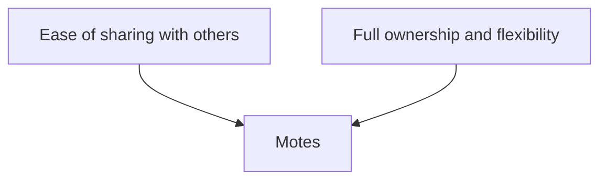

Hey 👋, I am happy you made it here! This is an example demonstrating how you can use [Motes](https://github.com/thass0/motes) to manage and share your notes. The other note found in this example repository is [here](https://thasso.xyz/motes-example/foo/bar.html).

There are no browsing menus built into this site, so you must know what paths and what files exist. `motes-share` does this for you automatically.

By virtue of using Pandoc, you get all of the nice Markdown stuff with Motes such as ...

| Markdown tables   | written in          |
|-------------------|---------------------|
| any of the styles | supported by Pandoc |

code blocks

```haskell
main :: IO ()
main = putStrLn "Hello, World"
```

and, if you want to, even diagrams:



Checkout the [README](https://github.com/thass0/motes#readme) for information on how to get started using Motes.

Lastly, here is a pretty picture from [Learn You a Haskell for Great Good](http://learnyouahaskell.com/). As you can see, it's easy to use pictures in your notes, too!


